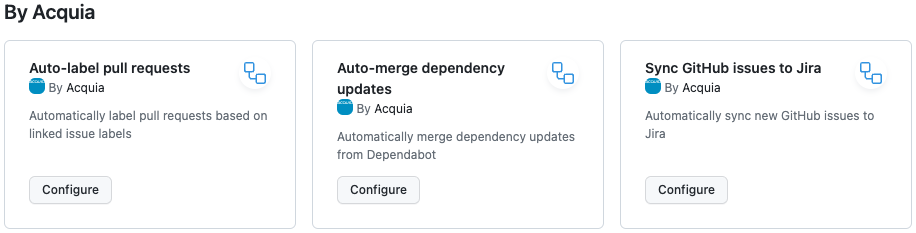

# .github

Default [community health](https://docs.github.com/en/communities/setting-up-your-project-for-healthy-contributions/creating-a-default-community-health-file), policy, and [workflow](https://docs.github.com/en/actions/using-workflows/using-starter-workflows) files for the Acquia organization on GitHub

## How to use

### Community health files

Community health files include files such as SUPPORT.md and issue templates. If a repository does not declare community health files of its own, the default versions from this repository will be used.

### Starter workflows

Public repositories in Acquia organization may use GitHub Actions. This repository provides starter workflows to support common use cases such as auto-merging dependencies, auto-labeling issues, and syncing GitHub issues with Jira. It also stores the canonical versions of the reuseable workflows used by the starter workflows.

Follow the [instructions to use starter workflows](https://docs.github.com/en/actions/using-workflows/using-starter-workflows#using-starter-workflows). Follow instructions in the workflows themselves to customize them for your project.

The starter workflows are available in the “By Acquia” section:

